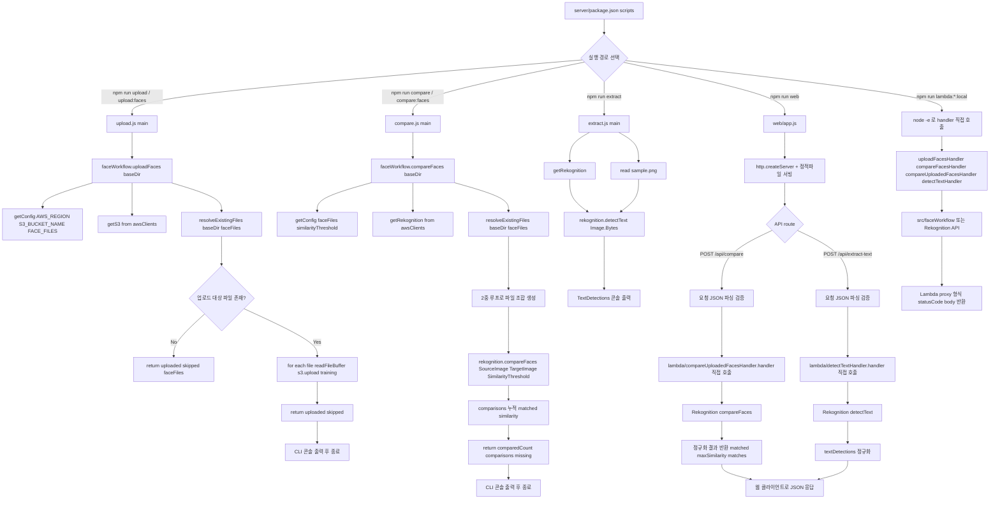
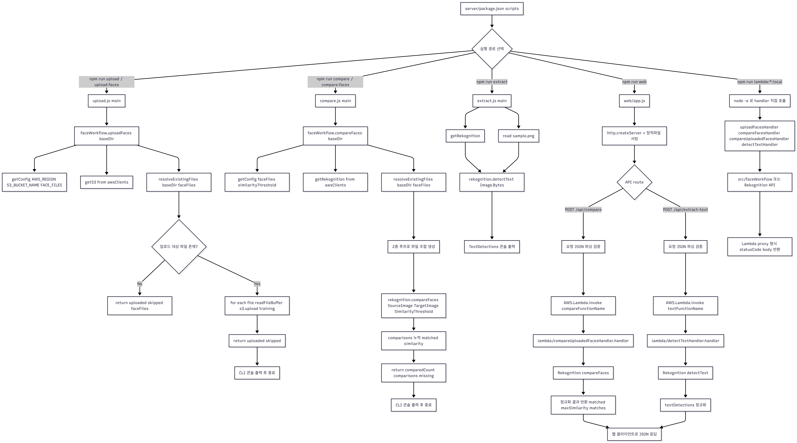

# Node.js Entry Point Flow (Mermaid)

아래 다이어그램은 이 저장소의 Node.js 실행 진입점(`server/package.json` scripts)에서 시작해,
로컬 CLI/웹/Lambda 핸들러까지 이어지는 주요 처리 흐름을 한 눈에 볼 수 있도록 정리한 것입니다.

---

```mermaid
flowchart TD
A[server/package.json scripts] --> B{실행 경로 선택}

B -->|npm run upload / upload:faces| U1[upload.js main]
U1 --> U2[faceWorkflow.uploadFaces baseDir]
U2 --> U3[getConfig AWS_REGION S3_BUCKET_NAME FACE_FILES]
U2 --> U4[getS3 from awsClients]
U2 --> U5[resolveExistingFiles baseDir faceFiles]
U5 --> U6{업로드 대상 파일 존재?}
U6 -->|No| U7[return uploaded skipped faceFiles]
U6 -->|Yes| U8[for each file readFileBuffer s3.upload training]
U8 --> U9[return uploaded skipped]
U9 --> U10[CLI 콘솔 출력 후 종료]

B -->|npm run compare / compare:faces| C1[compare.js main]
C1 --> C2[faceWorkflow.compareFaces baseDir]
C2 --> C3[getConfig faceFiles similarityThreshold]
C2 --> C4[getRekognition from awsClients]
C2 --> C5[resolveExistingFiles baseDir faceFiles]
C5 --> C6[2중 루프로 파일 조합 생성]
C6 --> C7[rekognition.compareFaces SourceImage TargetImage SimilarityThreshold]
C7 --> C8[comparisons 누적 matched similarity]
C8 --> C9[return comparedCount comparisons missing]
C9 --> C10[CLI 콘솔 출력 후 종료]

B -->|npm run extract| E1[extract.js main]
E1 --> E2[getRekognition]
E1 --> E3[read sample.png]
E2 --> E4[rekognition.detectText Image.Bytes]
E3 --> E4
E4 --> E5[TextDetections 콘솔 출력]

B -->|npm run web| W1[web/app.js]
W1 --> W2[http.createServer + 정적파일 서빙]
W2 --> W3{API route}

W3 -->|POST /api/compare| W4[요청 JSON 파싱 검증]
W4 --> W5[lambda/compareUploadedFacesHandler.handler 직접 호출]
W5 --> W6[Rekognition compareFaces]
W6 --> W7[정규화 결과 반환 matched maxSimilarity matches]
W7 --> W8[웹 클라이언트로 JSON 응답]

W3 -->|POST /api/extract-text| W10[요청 JSON 파싱 검증]
W10 --> W11[lambda/detectTextHandler.handler 직접 호출]
W11 --> W12[Rekognition detectText]
W12 --> W13[textDetections 정규화]
W13 --> W8

B -->|npm run lambda:*:local| L1[node -e 로 handler 직접 호출]
L1 --> L2[uploadFacesHandler compareFacesHandler compareUploadedFacesHandler detectTextHandler]
L2 --> L3[src/faceWorkflow 또는 Rekognition API]
L3 --> L4[Lambda proxy 형식 statusCode body 반환]
```
---

